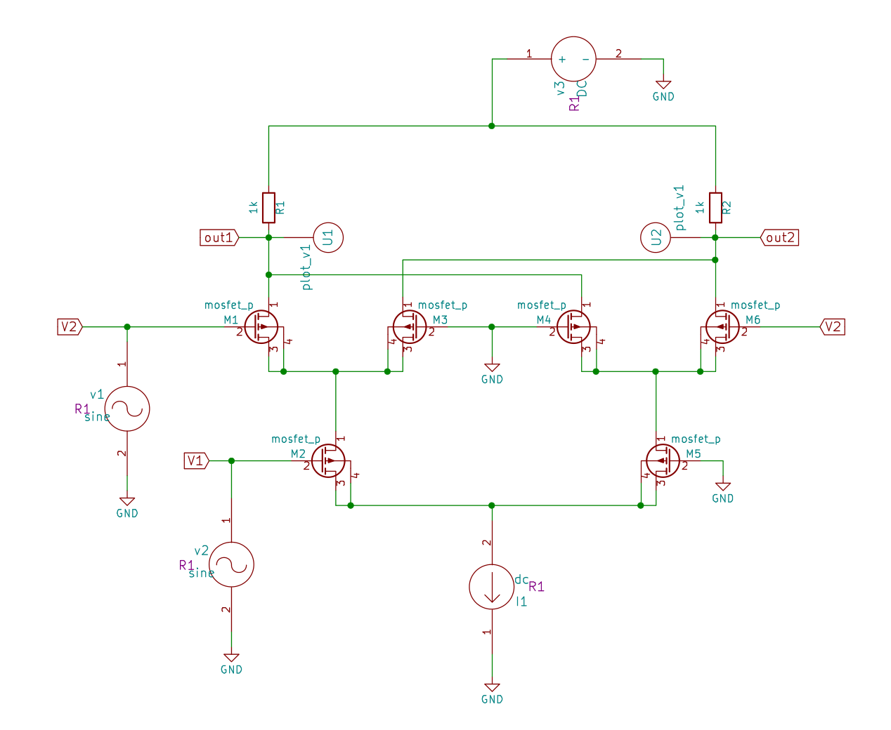
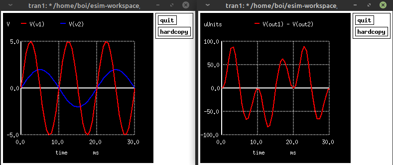

# FOSSEE eSim Hackathon
My submission for the [eSim Hackathon](https://hackathon.fossee.in/esim/) organized by FOSSEE, IIT Bombay

## Analog Circuit-Block for designing an ANN - Gilbert cell-based Multiplier
Test platform: Linux Mint x86_64 kernel 5.4.0

Prerequisite: eSim, download [here](https://esim.fossee.in/downloads) or ngspice (only simulation)
 
### Introduction
The basic artificial neural networks are formed by linear layers that perform the operation `weights * input + bias`, one of the main operation here is the calculation of the product. In analog circuits, such operation is performed with the help of an analog multiplier. For the purpose of my design, I followed the approach of Gencer et al. and decided to work on implementing the Gilbert cell-based Multiplier that was designed by Barrie Gilbert in his paper published in 1968.

### Implementation

  

 
I implemented the design using PMOS devices, the circuit works by utilizing pairs of differential amplifiers that divide the tail current provided by a current source I1 (another PMOS device controlled by a voltage Vbias). The output of the multiplier, Vout should follow the equation `Vout = K * V1 * V2`, where K depends on the circuit parameters and V1, V2 are input voltages. If we take one differential pair of MOSFETs with same input V1 and apply a tail current I1, the current is equally divided and there is no voltage difference across the resistor pairs. 

In Gilbert Cell multiplier, we send the tail current I1 through a differential pair (formed by M2 and M5) that has input V1, the divided tail current is then fed into two differential pairs (M1-M3 and M4-M6), here the input V2 is fed into the pairs using a cross-connection as depicted in the circuit diagram. The currents from this stage then reach the resistors, R1 and R2 at the top end near V3(VDD). The difference between the voltage drops across these resistors is our output Vout. The output can also be obtained in the form of difference in currents `(Ia - Ib = Iout = K * V1 * V2)` by using two more differential pairs.

The values of the neurons and weights can be fed as analog voltage at V1 and V2 resp. and the result can be added to a bias value using an adder circuit.

The other possible applications of this circuit are:
    * variable gain amplifier
    * automatic gain control circuits
    * balanced modulator
    * frequency mixer
    * phase detector

### Note regarding the plot
The plot submitted in the literature review report showed the graph of Iout/Vout plotted against V1 for various values of V2, it is not possible to draw a plot that involves three different axes in ngspice so in my final report I have submitted two plots where two sine waves of different amplitude and frequency are multipied with each other using the gilbert cell.

### Files

* `PMOS-180nm.lib` - lib file for simulation of PMOS device 
* `test_gilbert.cir.out` - netlist for the circuit
* `./reports` - reports submitted to FOSSEE
* `./eSim` - contains schematic and project files to open in eSim

### How to run in ngspice

* If using eSim lib, provide path to `PMOS-180nm.lib` file and in case of sky130nm, provide path to `sky130_fd_pr__pfet_01v8.lib` in the test_gilbert.cir.out file
* modify simulation parameters according to need in test_gilbert.cir.out file
* open terminal and run simulation using `ngspice test_gilbert.cir.out`

### Relevant readings

* [Design of An Analog Circuit-Based Artificial Neural Network
](https://ieeexplore.ieee.org/abstract/document/8990559) by Gencer et al.
* [Basics of the Gilbert Cell](https://www.youtube.com/watch?v=7nmmb0pqTU0) by W2AEW on Youtube
* [The Gilbert cell](https://ieeexplore.ieee.org/document/6499939/) by Barrie Gilbert - Original Paper

